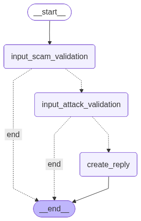

# YouTube Live Chat Service

A sophisticated YouTube live chat interaction system that monitors streams and responds to viewer messages using AI language models. This component integrates seamlessly with the EchoBot streaming system and runs as a standalone FastAPI service.



## ✨ Features

- **FastAPI Server**: Runs as a standalone service with a `/healthcheck` endpoint.
- **Live Chat Monitoring**: Fetches new messages from the active YouTube live stream.
- **AI-Powered Responses**: Uses a configurable LangGraph agent to generate contextual and safe responses.
- **Audience Engagement**: Posts responses back to the live chat to interact with viewers.
- **Automatic Broadcast Management**: Automatically finds the active stream or creates a new one on startup.
- **Memory System**: Remembers which messages have been answered to avoid duplication.
- **Self‑healing runtime**: Detects deleted/ended broadcasts, clears stale state, and automatically re‑initializes to the next valid broadcast without manual intervention.
- **Robust healthcheck**: Returns an active chat URL for both live and upcoming streams; only returns 503 when the broadcast is definitively inactive or missing.

## 🚀 Getting Started

### Prerequisites

- **Python 3.13+**
- **Google Cloud Project** with YouTube Data API v3 enabled.
- An LLM provider API key (e.g., Together AI, Google AI).

### Configuration

#### 1. Environment Variables

This service is configured using environment variables. At the root of the `echobot` project, create a `.env` file if you don't have one. Add the following variables required by this service:

```env
# --- YouTube OAuth (required) ---
# See the "OAuth Setup" section below for instructions on how to get these.
OAUTH_CLIENT_ID=your-google-oauth-client-id.apps.googleusercontent.com
OAUTH_CLIENT_SECRET=your-google-oauth-client-secret
YOUTUBE_REFRESH_TOKEN=your-youtube-refresh-token

# --- Service Control ---
YOUTUBE_ENABLED=true
PRIVACY_STATUS=unlisted # 'public', 'private', or 'unlisted'

# --- LLM Provider ---
# Set the API keys for the services you use.
GOOGLE_API_KEY=
TOGETHER_API_KEY=
```
*(For a full list of all possible environment variables, see `services/chat_youtube_service/env.example`)*

#### 2. OAuth Setup (Getting YouTube Refresh Token)

To interact with the YouTube API, the service needs OAuth credentials. Follow these steps to get your refresh token:

**Step 1: Enable YouTube Data API v3**
1. Go to [Google Cloud Console](https://console.cloud.google.com/)
2. Select or create a project
3. Navigate to **APIs & Services** > **Library**
4. Search for "YouTube Data API v3"
5. Click **Enable**

**Step 2: Configure OAuth Consent Screen**
1. Go to **APIs & Services** > **OAuth consent screen**
2. Choose **External** (unless you have a Google Workspace account)
3. Fill in the required fields:
   - App name: "EchoBot Chat Bot" (or your choice)
   - User support email: Your email
   - Developer contact: Your email
4. Click **Save and Continue**
5. On **Scopes** page, click **Add or Remove Scopes**
6. Search for and add: `https://www.googleapis.com/auth/youtube.force-ssl`
7. Click **Save and Continue**
8. Add test users (your Google account) if in testing mode
9. Click **Save and Continue** through the remaining screens

**Step 3: Create OAuth Client ID**
1. Go to **APIs & Services** > **Credentials**
2. Click **+ CREATE CREDENTIALS** > **OAuth client ID**
3. Choose **Desktop application** as the application type
4. Give it a name (e.g., "EchoBot Chat Bot")
5. Click **Create**
6. A popup will show your **Client ID** and **Client Secret** - copy these immediately (you can't see the secret again)

**Step 4: Add Credentials to `.env` File**
Add the following to your project's root `.env` file:
```env
OAUTH_CLIENT_ID=your-client-id-here.apps.googleusercontent.com
OAUTH_CLIENT_SECRET=your-client-secret-here
```

**Step 5: Generate Refresh Token**
1. From the root of the `echobot` project, run:
   ```bash
   python scripts/get_youtube_refresh_token.py
   ```
2. A browser window will automatically open
3. **Log in with the Google account that owns your YouTube channel**
4. Click **Allow** to grant permissions
5. The script will print your **refresh token** in the terminal

**Step 6: Add Refresh Token to `.env`**
Add the refresh token to your `.env` file:
```env
YOUTUBE_REFRESH_TOKEN=your-refresh-token-here
```

**Troubleshooting:**
- If you see "redirect_uri_mismatch": Make sure you selected "Desktop application" when creating the OAuth client
- If refresh token is not generated: Make sure you're using a Google account that has access to YouTube
- If the script fails: Verify `OAUTH_CLIENT_ID` and `OAUTH_CLIENT_SECRET` are correctly set in your `.env` file

That's it! The service is now configured to authenticate with YouTube.

## 🎮 Usage

### Running the Service Locally

To run the FastAPI server directly for development:

```bash
# From the root of the echobot project
python -m uvicorn services.chat_youtube_service.src.main:app --host 0.0.0.0 --port 8002 --reload
```
You can now access the OpenAPI documentation at [http://localhost:8002/docs](http://localhost:8002/docs).

### Docker Usage

This service is designed to be run as a Docker container.

#### Building the Image

To build the Docker image, run the following command from the **root directory** of the `echobot` project:

```bash
docker build -t chat_youtube_service -f services/chat_youtube_service/Dockerfile .
```

#### Running the Container

Once built, run the container with this command, also from the project root. This command maps the necessary log and media folders and provides the environment variables from your `.env` file.

```bash
docker run -d --rm --name chat_youtube_service_container -p 8002:8002 -v "$(pwd)/logs:/app/logs" -v "$(pwd)/app/media:/app/media" --env-file ./.env chat_youtube_service
```
*(Note: The internal port is now also 8002 for consistency)*

#### Accessing the Service

- **Health Check**: `http://localhost:8002/healthcheck`
- **API Docs**: `http://localhost:8002/docs`
- **Logs**: `docker logs -f chat_youtube_service_container`

## 🛡️ Healthcheck & Self‑Healing Behavior

- The `/healthcheck` returns `200 OK` with `{ "chat_url": "<youtube_url>" }` when:
  - There is an active broadcast (`live`) with chat, or
  - The broadcast is `upcoming` (waiting room) and chat is already available.
- The endpoint returns `503 Service Unavailable` with a helpful `detail` message only when the broadcast is definitively inactive or missing.
- The service is **self‑healing**:
  - If a broadcast is deleted/ended, the service clears its internal state and automatically attempts to find/create a new broadcast on the next cycle.
  - Right after creating a broadcast, it patiently waits for the chat to initialize (retries for ~30 seconds) before declaring chat unavailable.
  - Transient API/network errors during verification do not immediately mark the broadcast as invalid, avoiding false negatives.

---

**Happy Chatting! 💬🤖**

