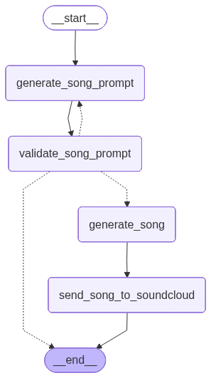

# Music Generation Service

## Overview

The Music Generation Service is a key component of the EchoBot ecosystem, responsible for autonomously creating and managing a fresh and engaging music library. It leverages a sophisticated AI agent that learns from its own creations to continuously evolve the radio's musical style.

### Key Features

- **AI-Powered Music Generation**: At its core is a music agent that uses generative AI to compose original music.
- **Adaptive Music Style**: The agent maintains a "memory" of previously generated tracks, allowing it to refine and adapt its style over time, ensuring the music remains varied and interesting.
- **SoundCloud Integration**: Includes tools for interacting with SoundCloud, allowing for potential future integration for music hosting and distribution.
- **Scheduled Content Creation**: The service runs on a schedule, automatically generating a configurable number of new songs at regular intervals to keep the content library fresh.

### Music Agent

The music agent is the heart of this service. Its behavior is guided by a predefined personality and music style, and it uses a stateful graph to manage the music generation process.



## Configuration

The service can be configured through the central `config.py` file and environment variables in `.env`.

A key setting is the number of songs to generate per cycle, which can be set in your `.env` file:

```env
NUMBER_OF_SONGS=1
```

## Getting Started

### Prerequisites

- Docker
- Python 3.12
- An `.env` file in the project root with the necessary environment variables.

### 1. Building the Docker Image

To build the Docker image for the service, run the following command from the project root:

```bash
docker build -t music_service -f services/music_service/Dockerfile .
```

If you need to rebuild the image without using the cache, use the `--no-cache` flag:

```bash
docker build --no-cache -t music_service -f services/music_service/Dockerfile .
```

### 2. Running the Docker Container

Before running, ensure any previous container with the same name is stopped and removed:

```bash
docker stop music_service_container
docker rm music_service_container
```

#### For Development / Debugging

To run the container in the foreground (interactive mode) and see the logs directly in your terminal, use this command. This is recommended for debugging.

**Note:** This command maps the `C:/app/media` directory from your host machine into the container. Ensure this directory exists.

```bash
docker run -it --name music_service_container -v "$(pwd)/logs:/app/logs" -v "//c/app/media:/app/media" --env-file ./.env music_service
```

```bash
docker run -it --name music_service_container -v "$(pwd)/.env:/app/.env" -v "$(pwd)/logs:/app/logs" -v "//c/app/media:/app/media" --env-file ./.env music_service
```

#### For Production / Detached Mode

To run the container in the background (detached mode), use this command:

```bash
docker run -d --name music_service_container -v "$(pwd)/logs:/app/logs" -v "//c/app/media:/app/media" --env-file ./.env music_service
```

### 3. Managing the Container

#### Checking Logs

If the container is running in detached mode, you can view its logs with this command:

```bash
docker logs -f music_service_container
```

#### Stopping the Container

To stop the running container:

```bash
docker stop music_service_container
```

To remove the stopped container:

```bash
docker rm music_service_container
```

## Running Locally (Without Docker)

For development purposes, you can run the service directly on your machine using a Python virtual environment.

### 1. Create and Activate Virtual Environment

From the project root, create a virtual environment:

```bash
python -m venv venv
```

Activate the environment:

**Windows:**
```bash
venv\\Scripts\\activate
```

**macOS / Linux:**
```bash
source venv/bin/activate
```

### 2. Install Dependencies

Install the required packages from the `pyproject.toml` file:

```bash
pip install -e .
```

**Note:** The `-e` flag installs the project in "editable" mode, which is useful for development.

### 3. Run the Service

Once the dependencies are installed, you can run the service with the following command:

```bash
python -m services.music_service.src.main
```
